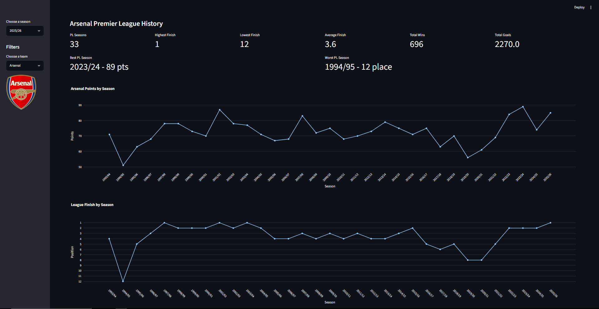

# ⚽ Premier League Performance Dashboard

As a lifelong football fan and aspiring data analyst, I wanted to build a project that combined my interest in football with data analysis and software development.

This dashboard analyses Premier League performance from the inaugural 1993/94 season through to the 2025/26 season. Users can explore team performance, league standings, historical trends, club history and season statistics through an interactive web application built entirely in Python.

The project started as a simple Streamlit dashboard displaying match results but evolved into a full analytics platform featuring over 30 seasons of Premier League data, dynamic league table generation, club history analysis and interactive visualisations.

The goal of this project was to strengthen my skills in:

* Python development
* Data analysis with Pandas
* Data visualisation with Plotly
* Building interactive applications with Streamlit
* Version control with Git and GitHub
* Working with real-world football datasets

## Dashboard Preview

The dashboard provides an interactive overview of team performance, including league position, points, goals scored, win rate, season outcome and visual performance breakdowns.

---

## Key Features

### 📊 Team Performance Analysis

Select any Premier League club and instantly view:

* League position
* Points total
* Win rate
* Goals scored
* Goals conceded
* Goal difference
* Season outcome classification

### 📈 Historical Club Analysis

Analyse a club's complete Premier League history including:

* Total Premier League seasons
* Highest and lowest league finishes
* Average finishing position
* Best season by points earned
* Total Premier League wins
* Total goals scored

The club history section allows users to analyse over three decades of Premier League performance through season-by-season trends, points totals and league finishes.

### 🏆 League Standings

Generate league tables directly from match data with:

* Automatic points calculation
* Goal difference ranking
* Top 4 qualification highlighting
* Team-specific highlighting

League standings are generated dynamically from match results and include visual highlighting for Champions League qualification places and the selected team.

### ⚽ Match & Form Analysis

* Recent form tracking
* Match history explorer
* Results distribution analysis
* Home vs away performance comparison

### 📅 Multi-Season Support

The dashboard supports every Premier League season from:

1993/94 → 2025/26

allowing users to compare teams across more than three decades of Premier League history.

---

## What I Learned

This project significantly improved my understanding of:

* Transforming raw data into meaningful insights
* Building reusable Python functions
* Structuring larger projects
* Creating professional dashboards
* Managing datasets across multiple seasons
* Using Git and GitHub for version control

One of the biggest challenges was handling historical Premier League datasets, as file formats and column structures varied between seasons. Building robust data handling and league table generation logic helped me gain experience working with imperfect real-world data.

---

## Future Improvements

Potential future enhancements include:

* Team comparison mode
* Player-level analytics
* Expected goals (xG) integration
* Additional league support
* Cloud deployment and live data updates

---

## About Me

I'm currently developing my skills in data analytics, Python development and business intelligence through personal projects that combine technical problem-solving with topics I'm passionate about.

This project represents one of my largest end-to-end data projects, covering data collection, cleaning, analysis, visualisation and application development.
